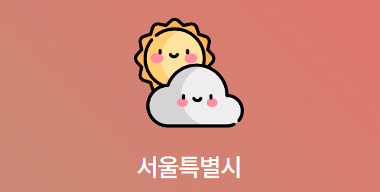

<h1>SlowStarter</h1>
<h3>
  김광제
</h3>

  안녕하세요, 저는 <strong>Front-End & Back-End 풀스택 신입 개발자 김광제</strong>입니다.  
   
  <strong>열정</strong>과 <strong>아이디어</strong>가 넘치는 동료들과 함께할 때 최상의 <strong>시너지</strong>를 만들어냅니다.  
  팀원들과의 인간적인 <strong>교류</strong>를 중요하고 쓸데없는 시간은 없다라고 생각하며 맡은 일에 <strong>책임감</strong>을 가지고 다 해냅니다.  
  소프트웨어에 대한 강한 <strong>열정</strong>과 참신한 <strong>아이디어</strong>를 꿈꾸고 직관적인 인터페이스와 손쉬운 사용법을 실현하는 것이 저의 가치관입니다.  
  이런 생각을 바탕으로 좋은 신입 개발자가 되고 싶습니다.   

<h2>
  Contact
</h2>

- tymss@naver.com  
- 010-9388-4179
 
 
<h2>
  My Stack
</h2>

- Backend web development (Java, Servlet/JSP, Spring Boot)
- Frontend web development (HTML, CSS, javaScript, jQuery, React.js)
- Oracle
 

 

<h2>
    Languages and Tools
</h2>
<!-- 뱃지 사용방법 -->
  <!-- 뱃지 아이콘 사이트 -->
  <!--    -->
  

  &nbsp;&nbsp;
  &nbsp;&nbsp;
  &nbsp;&nbsp;
  &nbsp;&nbsp;
  

  &nbsp;&nbsp;
  &nbsp;&nbsp;
  

  &nbsp;&nbsp;
  &nbsp;&nbsp;

 
 

<h2>
  My Class
</h2> 
- 2023.10.05 ~ 2024.3.27 NCS [스마트웹&콘텐츠개발] 풀스택 자바웹개발자 수료

 

 

<h2>
  Project  
</h2>
<h3>
  Team Project
</h3>
<h4>
 The Shilla : 신라호텔 리뉴얼 & CRUD  
'24.02.22 - 24.02.29 (1주)' , 개발인원 7명
</h4>

<h4>
  프로젝트 개요
</h4>

 신라호텔 리뉴얼 입니다.  
 보기 편한 사이트로 서비스 개선, 호텔에 대한 정보를 보다 빠르게 확인할 수 있도록 편의성 강화, 단순 이미지로 구성된 구조 수정, 
 게시판 CRUD 구현

<h4>
 역할 : Front-End, Back-End
</h4>

 로그인, 회원가입 구현 
 리뉴얼한 신라호텔 홈페이지에 로그인, 회원가입, 게시판과 관련된 CRUD기능,  
 검색기능과 페이징처리를 추가 구현했습니다.

 

 
<h3>
  Project
</h3>
<h4>
  Project 01. Weather
</h4>

  React로 만든 날씨입니다. 
  날씨API를 사용하여 그 지역의 현재 날씨를 보여줍니다.

<h4>
  Front-End
</h4>
<a href="http://tymss0726.dothome.co.kr/Weather">
  자세히
</a>
 

 
<h4>
  Project 02. TodoList(예정)
</h4>

  React로 만든 할일입니다. 
  데이터 베이스 연결하여 spring으로 Back-End 구현 예정

<h4>
  Front-End, Back-End
</h4>
<a href="#">
  자세히
</a>
 

 
<h4>
  Project 03. RWD_Template
</h4>

  반응형 웹 사이트입니다.(LG 사이트를 참조) 
  제가 알아본 가전제품들을 이용한 사이트

<h4>
  Front-End
</h4>
<a href="http://tymss0726.dothome.co.kr/RWD_Template">
  자세히
</a>
 

 
<h4>
  Project 04. Makeprem
</h4>

  bxslider를 이용한 웹 사이트 
  제가 쓰는 화장품을 이용한 사이트

<h4>
  Front-End
</h4>
<a href="http://tymss0726.dothome.co.kr/Makeprem">
  자세히
</a>
 

 
<h4>
  Project 05. Gold Rica
</h4>

  모바일 웹 사이트 
  제가 알아봤던 반지를 이용한 사이트

<h4>
  Front-End
</h4>
<a href="http://tymss0726.dothome.co.kr/Mobile_Jewelry">
  자세히
</a>
 

 
